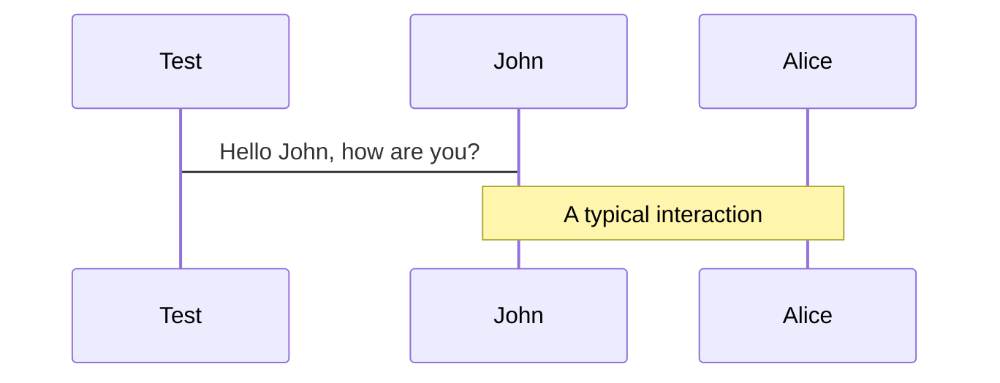

# Welcome 
# to Slidev-theme-euricom

## Your way to a better presentation

---
layout: cover
background: 'https://source.unsplash.com/1600x900/?nature,water'
hideInToc: true
---

# Welcome
# to Slidev-theme-euricom

## Always better with an image

---

# Agenda

<Toc />

---

# This will be the `colored heading`

And this can be used as test below it

- We can have a list.
- With a few items.
  - And som others
  - Items

> If you want to use a quote, you can use the > character.

<style>
h1 {
    code {
       @apply text-euri-green font-sans
    }
}
</style>

---

# Table data

| Syntax    | Description |                                               Test Text |
| :-------- | :---------- | ------------------------------------------------------: |
| Header    | Title       |                                             Here's this |
| Paragraph | Text        |                                                And more |
| Other     |             | Lorem ipsum dolor sit amet, consectetur adipiscing elit |


---
layout: center
---

# Centered text
## Lorem ipsum dolor sit amet

---
cols: 1-1 
---

# Left Heading

Lorem ipsum dolor sit amet, consectetur adipiscing elit, sed do eiusmod tempor incididunt ut labore et dolore magna aliqua. Ut enim ad minim veniam, quis nostrud exercitation ullamco laboris nisi ut aliquip ex ea commodo consequat. Duis aute irure dolor in reprehenderit in voluptate velit esse cillum dolore eu fugiat nulla pariatur. Excepteur sint occaecat cupidatat non proident, sunt in culpa qui officia deserunt mollit anim id est laborum.

::right::

# Right Heading

Lorem ipsum dolor sit amet, consectetur adipiscing elit, sed do eiusmod tempor incididunt ut labore et dolore magna aliqua. Ut enim ad minim veniam, quis nostrud exercitation ullamco laboris nisi ut aliquip ex ea commodo consequat. Duis aute irure dolor in reprehenderit in voluptate velit esse cillum dolore eu fugiat nulla pariatur. Excepteur sint occaecat cupidatat non proident, sunt in culpa qui officia deserunt mollit anim id est laborum.

---

# Code Snippets

Use code snippets and get the highlighting directly!

```html {all|2,3}
<template>
  <h1>Hello World"</h1>
  <div class="message">{{ message }}</div>
</template>
<script>
  export default {
    data:() => ({
      message: 'Great to be here!',
    })
  }
</script>
<style scoped>
  .message {
    color: red;
  }
</style>
```

---

# Editable code

You can edit the code inline

```ts{monaco}
// @ts-ignore
import { computed, unref, Ref  } from 'vue';

export function add(a: Ref<number> | number, b: number) {
  return computed(() => unref(a) + unref(b))
}

add(1, "2")
```

---
cols: 1-1 
---

# React Class Component

```ts
class HelloMessage extends React.Component {
  render() {
    return <div>Hello {this.props.name}</div>;
  }
}
```

::right::

# React Function Component


```ts
const HelloMessage => ({ name }) => ( {
  render() {
    return <div>Hello {this.props.name}</div>;
  }
}
```


---
layout: quote
author: Linus Borg (2021)
---

# Big quotes make your talk look fancy

---

# Embedded Style

> block quote, hello `world`

<div class="xlarge">
  <p>Extra large text</p>
</div>

<style>
.xlarge { 
  @apply text-red-500 text-8xl mt-10;
}

blockquote {
  code {
    @apply text-red-500 dark:text-teal-400;
  }
}
</style>

---

# Images


---
layout: image-left

# the image source
image: https://images.unsplash.com/photo-1452110040644-6751c0c95836?crop=entropy&cs=tinysrgb&fit=crop&fm=jpg&h=900&ixid=MnwxfDB8MXxyYW5kb218MHx8bmF0dXJlLHdhdGVyfHx8fHx8MTY1MTIzMTQ1NA&ixlib=rb-1.2.1&q=80&utm_campaign=api-credit&utm_medium=referral&utm_source=unsplash_source&w=1600

# a custom class name to the content
class: my-cool-content-on-the-right
---

# Keep it zen 

When you realize nothing is lacking, the whole world belongs to you

---
layout: image-right

# the image source
image: https://media.istockphoto.com/photos/programming-source-code-abstract-background-picture-id1047259374?s=612x612

# a custom class name to the content
class: my-cool-content-on-the-right
---

# The Programming Life

How many programmers does it take to change a light bulb? None, that’s a hardware problem

---
layout: iframe
url: https://react-query.tanstack.com/
---

---

# Diagrams support with mermaid



See more at https://mermaid-js.github.io/mermaid/#/
