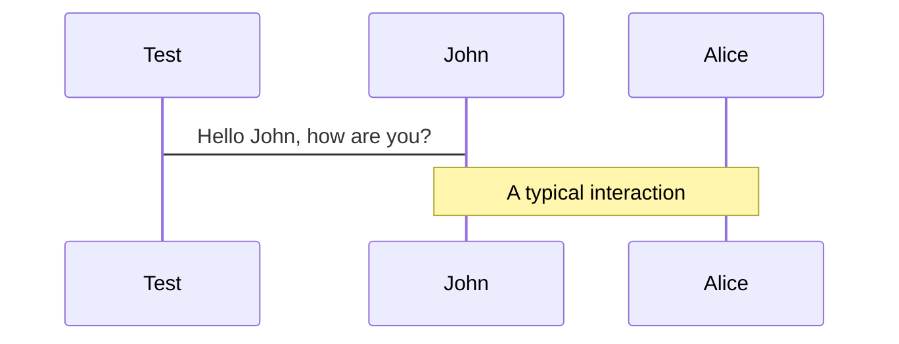

# Welcome 
# to Slidev-theme-euricom

## Your way to a better presentation

<div class="absolute bottom-10">
  <small>
  Copyright (c) 2022 Euricom nv.
  </small>
</div>

---
layout: cover
background: https://source.unsplash.com/1600x900/?nature,water
hideInToc: true
---

# Welcome
# to Slidev-theme-euricom

## Always better with an image

---
layout: section-dark
background: https://source.unsplash.com/1600x900/?nature
---

# This is a section
## With sub title

---

# This will be the `colored heading`

And this can be used as test below it

- We can have a list.
- With a few items.
  - And som others
  - Items

> If you want to use a quote, you can use the > character.

---
layout: big-points
titleRow: true
---

# Need to make a few big points?

- Increased font size...
- ...and centered content
- help stressing a few points


---

# Navigation

Hover on the bottom-left corner to see the navigation's controls panel, [learn more](https://sli.dev/guide/navigation.html)

### Keyboard Shortcuts

| Key                                                 | Description                 |
| --------------------------------------------------- | --------------------------- |
| <kbd>right</kbd> / <kbd>space</kbd>                 | next animation or slide     |
| <kbd>left</kbd>  / <kbd>shift</kbd><kbd>space</kbd> | previous animation or slide |
| <kbd>up</kbd>                                       | previous slide              |
| <kbd>down</kbd>                                     | next slide                  |


---

# Table data

| Syntax    | Description |                                               Test Text |
| :-------- | :---------- | ------------------------------------------------------: |
| Header    | Title       |                                             Here's this |
| Paragraph | Text        |                                                And more |
| Other     |             | Lorem ipsum dolor sit amet, consectetur adipiscing elit |


---
cols: 1-2 
---

# Left Heading

Lorem ipsum dolor sit amet, consectetur adipiscing elit, sed do eiusmod tempor incididunt ut labore et dolore magna aliqua. Ut enim ad minim veniam, quis nostrud exercitation ullamco laboris nisi ut aliquip ex ea commodo consequat. Duis aute irure dolor in reprehenderit in voluptate velit esse cillum dolore eu fugiat nulla pariatur. Excepteur sint occaecat cupidatat non proident, sunt in culpa qui officia deserunt mollit anim id est laborum.

::right::

# Right Heading

Lorem ipsum dolor sit amet, consectetur adipiscing elit, sed do eiusmod tempor incididunt ut labore et dolore magna aliqua. Ut enim ad minim veniam, quis nostrud exercitation ullamco laboris nisi ut aliquip ex ea commodo consequat. Duis aute irure dolor in reprehenderit in voluptate velit esse cillum dolore eu fugiat nulla pariatur. Excepteur sint occaecat cupidatat non proident, sunt in culpa qui officia deserunt mollit anim id est laborum.

---
slideTitle: Two columns with single title
titleRow: true
cols: 1-2 
---

### Right Heading

This content can now be styled/positioned independent of the title, because it will be in a separate grid cell.

::right::

### Left Heading

This content can now be styled/positioned independent of the title, because it will be in a separate grid cell.

---

# Code Snippets

Use code snippets and get the highlighting directly!

```html {all|2,3|4,5|6,7|8,9}
<template>
  <h1>Hello World"</h1>
  <div class="message">{{ message }}</div>
</template>
<script>
  export default {
    data:() => ({
      message: 'Great to be here!',
    })
  }
</script>
<style scoped>
  .message {
    color: red;
    bg: yello
  }
</style>
```


---

# Editable code

You can edit the code inline

```ts{monaco}
// @ts-ignore
import { computed, unref, Ref  } from 'vue';

export function add(a: Ref<number> | number, b: number) {
  return computed(() => unref(a) + unref(b))
}

add(1, "2")
```

---
cols: 1-1 
class: code-small
---

# React Class Component

```ts
class HelloMessage extends React.Component {
  render() {
    return <div>Hello {this.props.name}</div>;
  }
}
```

::right::

# React Function Component


```ts
const HelloMessage => ({ name }) => ( {
  render() {
    return <div>Hello {this.props.name}</div>;
  }
}
```

---

# Enlarge Code Snippets

<div class="code-xsmall">

```ts
// code-xsmall
const number = 12;
console.log(number)
```

</div>

<div class="code-small">

```ts
// code-small
const number = 12;
console.log(number)
```

</div>

<div>

```ts
// default
const number = 12;
console.log(number)
```
</div>


<div class="code-large">

```ts
// code-xlarge
const number = 12;
console.log(number)
```
</div>


---
layout: quote
author: Linus Borg (2021)
background: '/photo4.jpeg'
---

# Big quotes make your talk look fancy

---

# Embedded Custom Style

> block quote, hello `world`

<div class="xlarge">
  Green large text
</div>


<style>
.xlarge { 
  @apply text-green-500 text-7xl mt-2 font-bold;
}

blockquote {
  code {
    @apply text-red-500 dark:text-teal-400;
  }
}
</style>

---

# Images


---
layout: image-left
image: https://images.unsplash.com/photo-1452110040644-6751c0c95836?crop=entropy&cs=tinysrgb&fit=crop&fm=jpg&h=900&ixid=MnwxfDB8MXxyYW5kb218MHx8bmF0dXJlLHdhdGVyfHx8fHx8MTY1MTIzMTQ1NA&ixlib=rb-1.2.1&q=80&utm_campaign=api-credit&utm_medium=referral&utm_source=unsplash_source&w=1600
class: code-small
---

# Keep it zen 

When you realize nothing is lacking, the whole world belongs to you

```md
---
layout: image-left
image: https://images.com/my-image.png
---
```

---
layout: image-right
image: https://media.istockphoto.com/photos/programming-source-code-abstract-background-picture-id1047259374?s=612x612
class: code-small
---

# The Programming Life

How many programmers does it take to change a light bulb? None, that’s a hardware problem

```md
---
layout: image-right
image: https://images.com/my-image.png
---
```

---
layout: iframe
url: https://react-query.tanstack.com/
---

---

# Diagrams support with mermaid



See more at https://mermaid-js.github.io/mermaid/#/

---

# Icons

### [Rocket](https://iconscout.com/unicons)

<uim-rocket />
<uim-rocket class="text-3xl text-red-400 mx-2" />
<uim-rocket class="text-3xl text-orange-400 animate-ping m-2" />

### [materialdesignicons](https://materialdesignicons.com/)

<mdi-account-circle class="text-3xl m-2" />
<mdi-account-clock class="text-3xl m-2" />

### [Twitter Emoji (Twemoji)](https://github.com/twitter/twemoji)
See https://emojipedia.org/

<twemoji-cat-with-tears-of-joy class="text-3xl m-2" />

<twemoji-slightly-smiling-face class="text-3xl m-2 " />
<twemoji-fire class="text-3xl m-2" />

